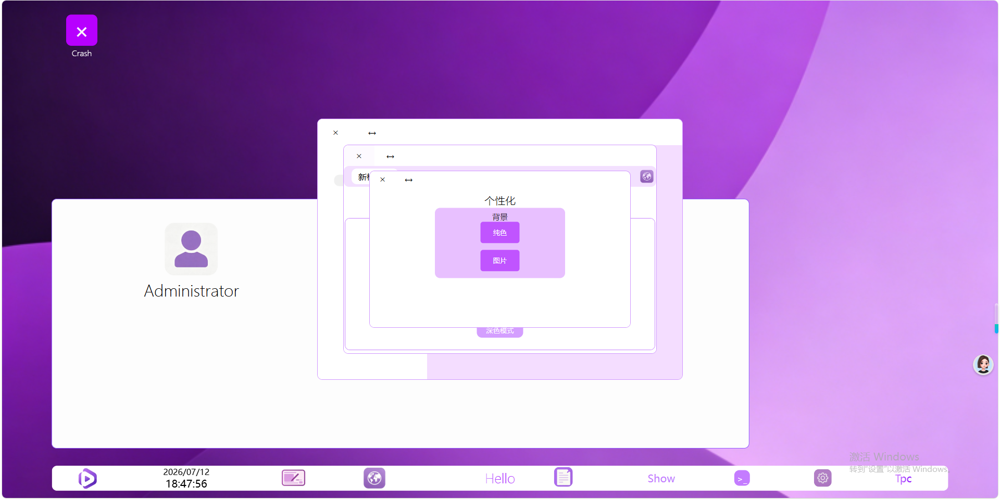

# Ghvswebtpc

# 项目预览

# 项目地址

[项目体验地址](https://t-pagecode.github.io/Ghvswebtpc) 
[GitHub仓库地址](https://github.com/T-PageCode/Ghvswebtpc) 
[GitCode仓库地址](https://gitcode.com/T-PageCode/Ghvswebtpc) 

# Ghvswebtpc网页版系统

感谢GitHub提供的GitHub Pages服务,此系统的“安装程序”只是网页模拟安装,并不会真的在您的电子产品中安装一些文件/文件夹
此系统为纯HTML,CSS,JS技术构成**网页版系统**。
# 作者信息

开发者: T-PageCode,H-PageCode(H-PageCode是应急时使用)
首次开发时间: 2026年6月
# 在源码中，有很多可能不是很好懂的文件名。

带_cj的是纯净界面，而_cj的cj刚好是纯净(ChuenJing)的拼音缩写。
Gxh是个性化(GeXingHua)的拼音缩写。
# 体验方式

直接访问<https://t-pagecode.github.io/Ghvswebtpc>即可体验。
# 开发工具

##### 开发工具是:
*托管平台:* [GitHub](https://github.com),[GitCode](https://gitcode.com)
*写代码工具:* [Visual Studio Code](https://code.visualstudio.com),[GitHub](https://github.com)

# 项目特点

不引入第三方库
想正常访问协议需要TLS 1.2,TLS 1.3
# Ghvswebtpc含义:

Gh = GitHub(在GitHub发布)
vs = Visual Studio Code和Visual Studio(我用的编辑器)
web = System In Browser,Web System(直接在浏览器中打开)
tpc = GitHub用户名
# 制作语言
HTML
CSS
JavaScript
# 主页换新通知
主页已换新,如果需要旧版本的主页请访问index-old.html

---

> [!IMPORTANT]
> 修改源码前建议先复制一份文件,代码较为紧凑,随意修改容易导致功能缺失,布局错乱等。

> [!WARNING]
> 此项目**不依靠第三方库**,如果您在源码中增加第三方库,可能导致布局错乱,样式失效等!

> [!NOTE]
> 最新代码以GitHub为准,GitCode会等几天才会同步。

> 本系统为网页模拟系统，并非真实物理系统